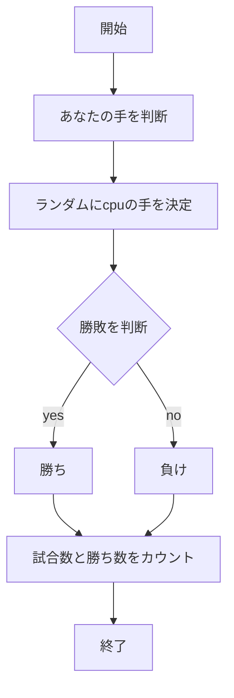
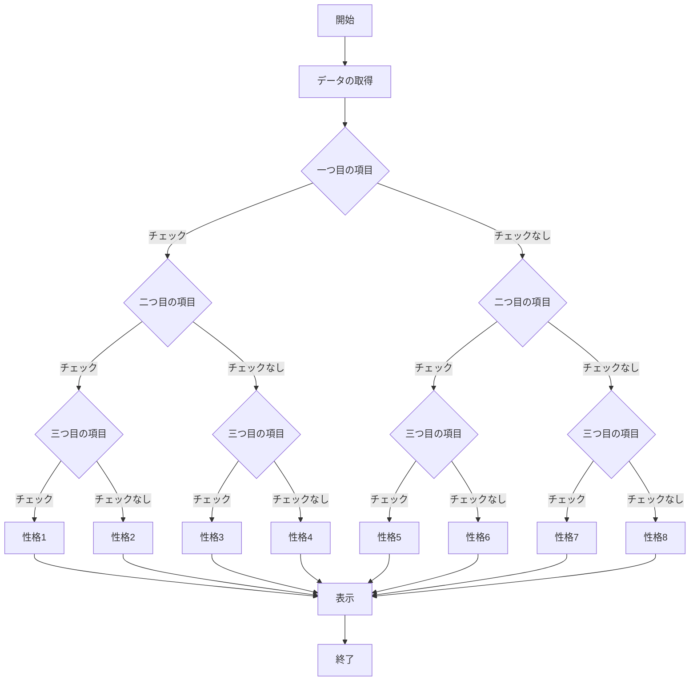
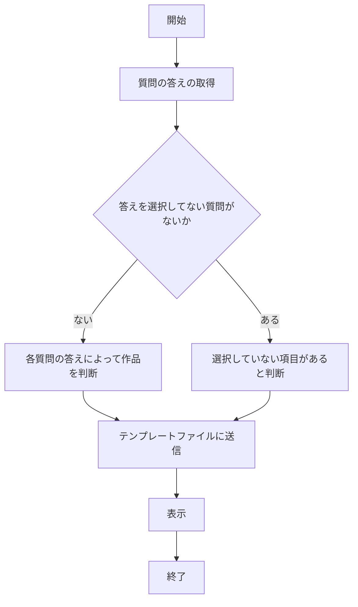

# webpro_06
## プログラムについて

## ファイル一覧
ファイル名 | 説明 
-|-
app5.js | プログラム本体
public/janken.html | じゃんけんの開始画面 
views/janken.ejs | じゃんけんのテンプレートファイル
public/shindan.html | 性格診断の開始画面
views/shindan.ejs | 性格診断のテンプレートファイル
public/recommend | おすすめガンダム作品診断の開始画面
views/recommend.ejs | おすすめガンダム作品診断のテンプレートファイル
 
##　じゃんけん
### 起動の手順
1. ターミナルで```node app5.js```を打ちapp5.jsを起動する．
1. Webブラウザでhttp://localhost:8080/public/janken.html にアクセスする．
1. 自分でじゃんけんの手を入力する．

### 機能
・cpuとじゃんけんをする．
・試合数と勝利数を記録する．


## 性格診断

### 起動の手順
1. ターミナルで```node app5.js```を打ちapp5.jsを起動する．
1. Webブラウザでhttp://localhost:8080/public/shindan.html にアクセスする．
1. 自分に当てはまるものにチェックを入れる．

###　機能
・選択したものによって性格を表示する．

### ドキュメント


## おすすめガンダム作品診断
###　起動の手順
1. ターミナルで```node app5.js```を打ちapp5.jsを起動する．
1. Webブラウザでhttp://localhost:8080/public/recommend.html にアクセスする．
1. 質問に答える．

### 機能
・五つの質問に答えると，それに合ったガンダム作品が表示される．

###　フローチャート



