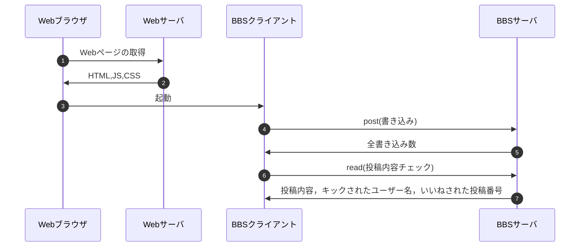
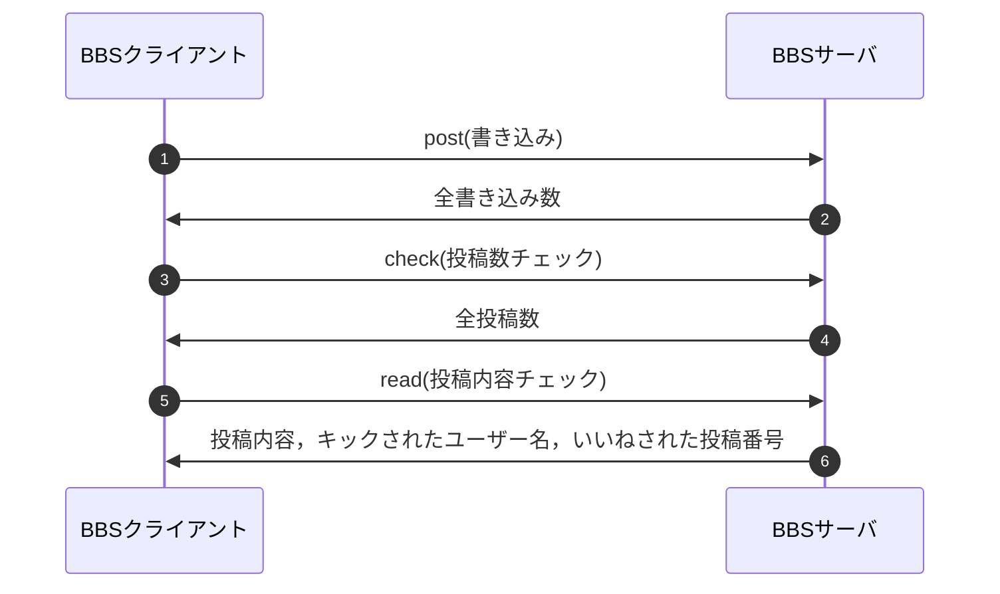
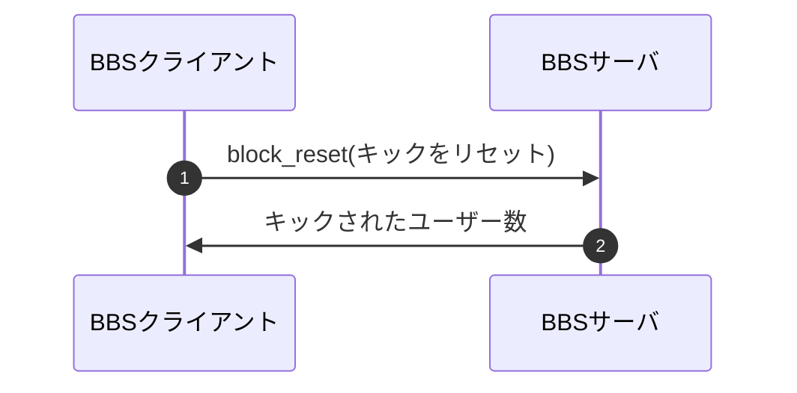
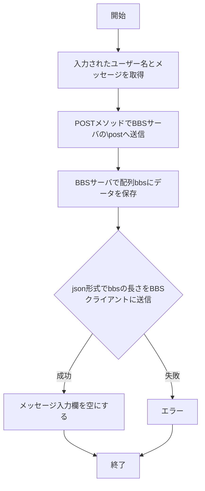
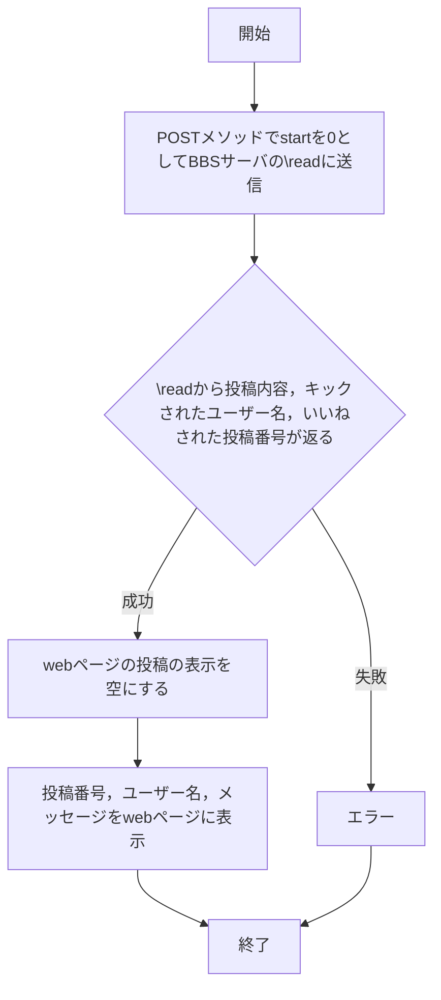
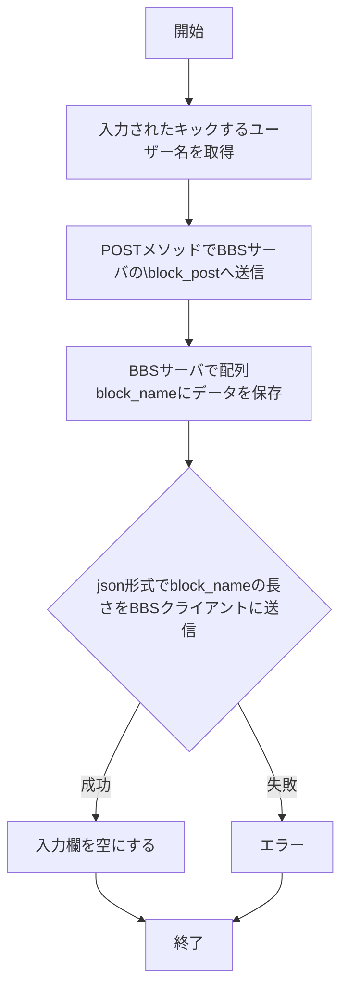

```mermaid
sequenceDiagram
  autonumber
  Webブラウザ ->> Webサーバ: Webページの取得
  Webサーバ ->> Webブラウザ:HTML,JS,CSS
  Webブラウザ ->> BBSクライアント:起動
  BBSクライアント ->> BBSサーバ:post(書き込み)
  BBSサーバ ->> BBSクライアント:全書き込み数
  BBSクライアント ->> BBSサーバ:read(投稿内容チェック)
  BBSサーバ ->> BBSクライアント:投稿内容，キックされたユーザー名，いいねされた投稿番号
```

```mermaid
sequenceDiagram
  autonumber
  BBSクライアント ->> BBSサーバ:post(書き込み)
  BBSサーバ ->> BBSクライアント:全書き込み数
  BBSクライアント->>BBSサーバ:check(投稿数チェック)
  BBSサーバ->>BBSクライアント:全投稿数
  BBSクライアント ->> BBSサーバ:read(投稿内容チェック)
  BBSサーバ ->> BBSクライアント:投稿内容，キックされたユーザー名，いいねされた投稿番号
```

```mermaid
sequenceDiagram
  autonumber
  BBSクライアント ->> BBSサーバ:block_post(キックするユーザー名)
  BBSサーバ ->> BBSクライアント:キックされたユーザー数
  BBSクライアント ->> BBSサーバ:read(投稿内容チェック)
  BBSサーバ ->> BBSクライアント:投稿内容，キックされたユーザー名，いいねされた投稿番号
```

```mermaid
sequenceDiagram
  autonumber
  BBSクライアント->>BBSサーバ:good_post(いいねする投稿の投稿番号)
  BBSサーバ->>BBSクライアント:いいねされた回数
  BBSクライアント->>BBSサーバ:read(投稿内容チェック)
  BBSサーバ->>BBSクライアント:投稿内容，キックされたユーザー名，いいねされた投稿番号
```

```mermaid
sequenceDiagram
  autonumber
  BBSクライアント ->> BBSサーバ:block_reset(キックをリセット)
  BBSサーバ ->> BBSクライアント:キックされたユーザー数
```

```mermaid
flowchart TD;

start["開始"];
yomitori["入力されたユーザー名とメッセージを取得"]
post["POSTメソッドでBBSサーバの\postへ送信"]
hozon["BBSサーバで配列bbsにデータを保存"]
hensin{"json形式でbbsの長さをBBSクライアントに送信"}
end1["終了"]
success["メッセージ入力欄を空にする"]
false["エラー"]

start --> yomitori
yomitori --> post
post --> hozon
hozon --> hensin
hensin -->|成功| success
success --> end1
hensin -->|失敗| false
false-->end1
```

```mermaid
flowchart TD;

start["開始"];
yomitori["POSTメソッドでstartを0としてBBSサーバの\readに送信"]
hozon{"\readから投稿内容，キックされたユーザー名，いいねされた投稿番号が返る"}
end1["終了"]
success["webページの投稿の表示を空にする"]
false["エラー"]
a["投稿番号，ユーザー名，メッセージをwebページに表示"]

start --> yomitori
yomitori --> hozon
hozon -->|成功| success
success --> a
a --> end1
hozon -->|失敗| false
false-->end1
```

```mermaid
flowchart TD;

start["開始"];
yomitori["入力されたキックするユーザー名を取得"]
post["POSTメソッドでBBSサーバの\block_postへ送信"]
hozon["BBSサーバで配列block_nameにデータを保存"]
hensin{"json形式でblock_nameの長さをBBSクライアントに送信"}
end1["終了"]
success["入力欄を空にする"]
false["エラー"]

start --> yomitori
yomitori --> post
post --> hozon
hozon --> hensin
hensin -->|成功| success
success --> end1
hensin -->|失敗| false
false-->end1
```

