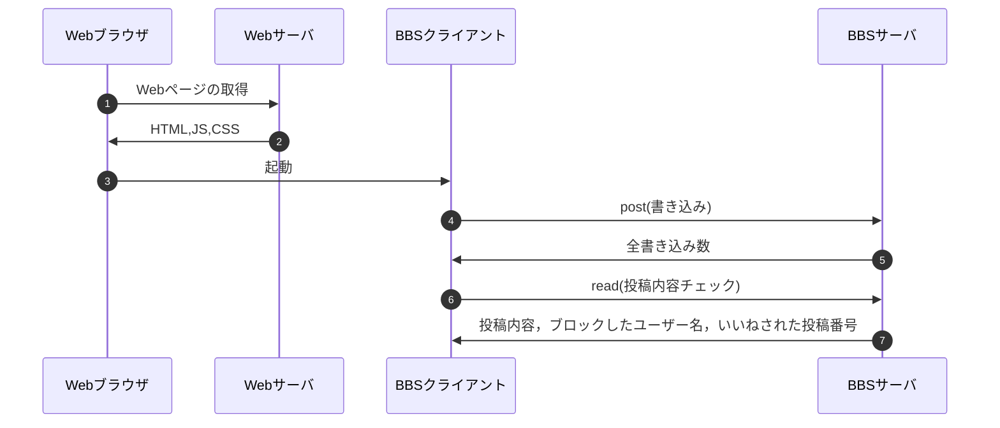
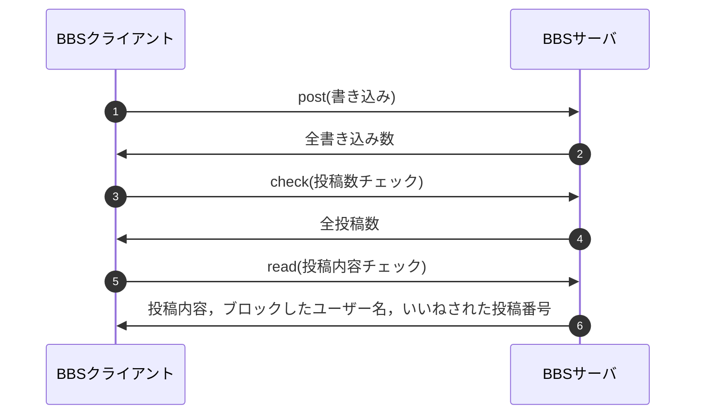
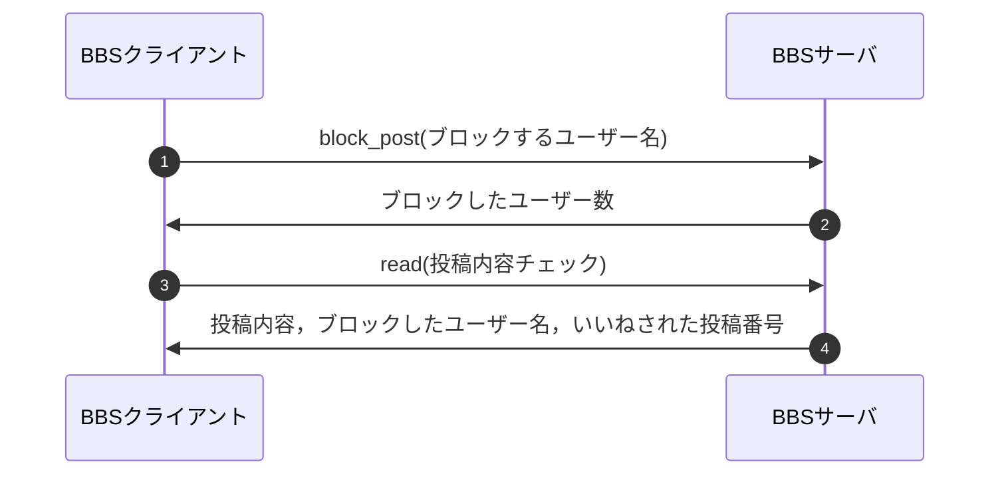
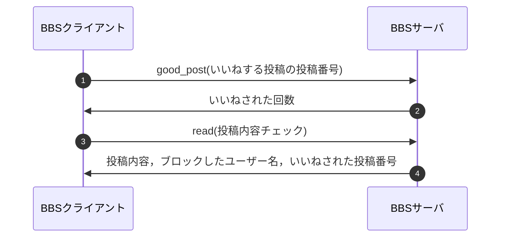

```mermaid
sequenceDiagram
  autonumber
  Webブラウザ ->> Webサーバ: Webページの取得
  Webサーバ ->> Webブラウザ:HTML,JS,CSS
  Webブラウザ ->> BBSクライアント:起動
  BBSクライアント ->> BBSサーバ:post(書き込み)
  BBSサーバ ->> BBSクライアント:全書き込み数
  BBSクライアント ->> BBSサーバ:read(投稿内容チェック)
  BBSサーバ ->> BBSクライアント:投稿内容，ブロックしたユーザー名，いいねされた投稿番号
```

```mermaid
sequenceDiagram
  autonumber
  BBSクライアント ->> BBSサーバ:post(書き込み)
  BBSサーバ ->> BBSクライアント:全書き込み数
  BBSクライアント->>BBSサーバ:check(投稿数チェック)
  BBSサーバ->>BBSクライアント:全投稿数
  BBSクライアント ->> BBSサーバ:read(投稿内容チェック)
  BBSサーバ ->> BBSクライアント:投稿内容，ブロックしたユーザー名，いいねされた投稿番号
```

```mermaid
sequenceDiagram
  autonumber
  BBSクライアント ->> BBSサーバ:block_post(ブロックするユーザー名)
  BBSサーバ ->> BBSクライアント:ブロックしたユーザー数
  BBSクライアント ->> BBSサーバ:read(投稿内容チェック)
  BBSサーバ ->> BBSクライアント:投稿内容，ブロックしたユーザー名，いいねされた投稿番号
```

```mermaid
sequenceDiagram
  autonumber
  BBSクライアント->>BBSサーバ:good_post(いいねする投稿の投稿番号)
  BBSサーバ->>BBSクライアント:いいねされた回数
  BBSクライアント->>BBSサーバ:read(投稿内容チェック)
  BBSサーバ->>BBSクライアント:投稿内容，ブロックしたユーザー名，いいねされた投稿番号
```